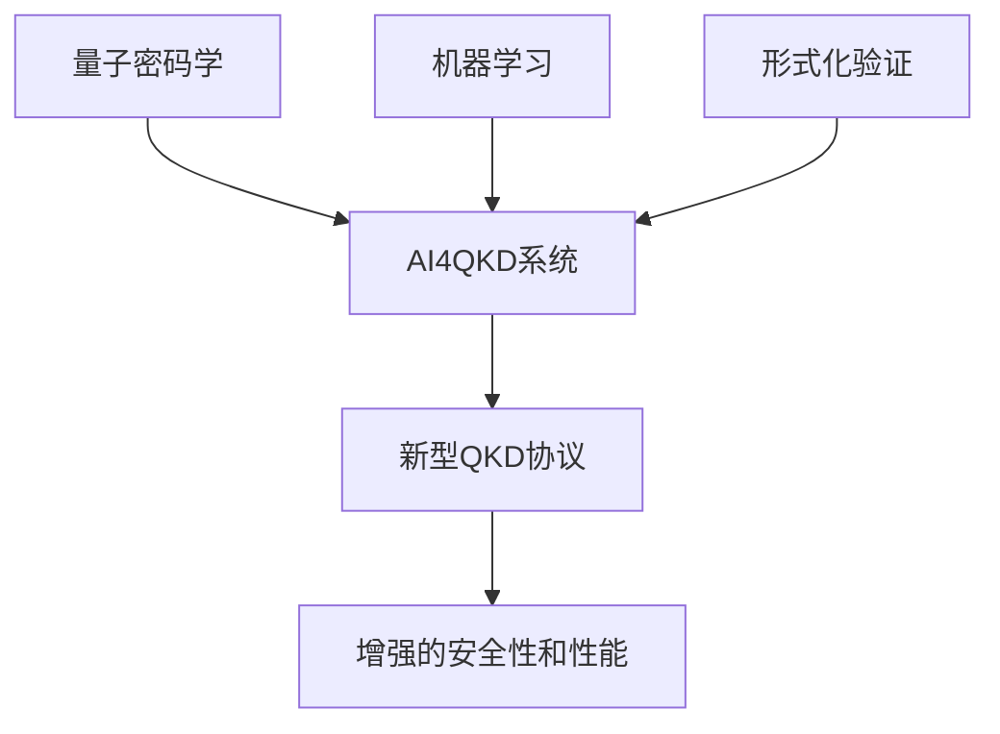

# AI4QKD: AI辅助量子密钥分发协议设计系统

[](https://opensource.org/licenses/MIT)
[](https://www.python.org/downloads/)
[](https://qiskit.org/)
[](https://scikit-learn.org/)

> 🎯 **研究目标**: 使用人工智能自动设计和优化量子密钥分发（QKD）协议，使其性能超越传统方法。

## 🌟 项目概述

AI4QKD是一个开创性的研究系统，将**人工智能**与**量子密码学**相结合，专注于**点对点离散变量量子密钥分发(DV-QKD)协议**的自动设计和优化。该项目通过AI驱动的协议设计空间探索，自动发现具有增强安全性和性能特征的新型QKD协议，解决了设计最优量子通信协议的根本性挑战。

### 🎯 技术定位 (2025-08-19重大更新)

AI4QKD项目专注于**离散变量量子密钥分发（DV-QKD）**技术，经过严格的技术纯化：

- **核心专业**: 点对点离散变量量子密钥分发(DV-QKD)
- **量子态类型**: 严格限定为离散量子态（|0⟩、|1⟩、|+⟩、|-⟩、|L⟩、|R⟩等）
- **测量技术**: 单光子探测器（SPD）和雪崩光电二极管（APD）
- **调制方式**: 偏振编码、相位编码、时分编码
- **应用场景**: 实际可部署的量子通信系统和QKD网络
- **技术边界**: **100%不涉及**连续变量QKD(CV-QKD)相关技术

**⚠️ 重要声明**: 本项目已在v2.0.1版本中完全移除所有连续变量QKD相关参数（如`discrimination_threshold`），确保技术方向的纯净性和专业性。我们专注于离散量子态的密钥分发协议，不支持相干态、压缩态等连续变量技术栈。

### 🔬 科学动机

传统的QKD协议（如BB84）是由密码学家手动设计的。随着量子通信系统变得越来越复杂，手动协议设计变得越来越具有挑战性。AI4QKD利用机器学习来：

- **探索** 自动探索广阔的协议设计空间
- **发现** 超越人类直觉的新型协议结构
- **优化** 在现实物理约束下的性能
- **验证** 通过形式化验证确保安全属性

## 📚 理论基础

本项目建立在量子密码学和机器学习的开创性工作基础上，参考文献包括但不限于：

### 核心参考文献

1. **[Gisin等，2002]** - "量子密码学"
   - *量子密码学基础原理和BB84协议*
   - 建立了QKD的理论安全保障

2. **[Dunjko & Briegel，2018]** - "量子领域的机器学习和人工智能"
   - *AI在量子技术中应用的综合综述*
   - 为AI-量子系统集成提供理论框架

3. **[现代物理评论，2024]** - QKD协议设计的最新进展
   - *量子通信优化的当代方法*
   - 协议性能评估的基准标准

### 研究方法

我们的方法整合了三个关键领域：



## 🚀 快速开始

### 安装

```bash
# 克隆仓库
git clone https://github.com/RoyalTeng/AI4QKD.git
cd AI4QKD

# 安装依赖（最小要求）
pip install -r requirements.txt

# 运行基础示例
python main.py --demo
```

### 基本使用

```python
from ai4qkd import QKDProtocol, AIDesigner, Simulator

# 创建基础BB84协议
bb84 = QKDProtocol.create_bb84()

# 初始化AI设计器
ai = AIDesigner()

# 设计改进协议
new_protocol = ai.design_protocol(bb84, target_improvement=0.05)

# 评估性能
simulator = Simulator()
results = simulator.compare_protocols(bb84, new_protocol)

print(f"改进幅度: {results['improvement']:.2f}%")
```

## 🔬 研究方法论

### 1. 协议表示

QKD协议表示为有向图，其中：
- **节点**: 量子操作（态制备、测量）和经典处理
- **边**: 量子信道和经典通信链路
- **参数**: 物理约束和优化变量

### 2. AI驱动优化

系统采用演化算法优化协议结构：

```python
# 遗传算法方法
population = initialize_protocol_variants(base_protocol)
for generation in range(max_generations):
    fitness = evaluate_security_performance(population)
    population = evolve_population(population, fitness)
    best_protocol = select_best(population)
```

### 3. 安全分析

每个生成的协议都经过严格的安全评估：
- **信息论安全**边界
- **有限密钥分析**用于实际场景
- **可组合安全**框架集成
- 协议属性的**形式化验证**

### 4. 性能指标

协议评估考虑多个维度：
- **密钥率**: 每个传输脉冲生成的安全比特数
- **QBER容错性**: 对信道噪声的鲁棒性
- **距离可扩展性**: 量子信道上的性能
- **实现复杂性**: 实际部署考虑

## 📊 实验结果

### 基准性能

| 协议 | 密钥率 (bits/pulse) | QBER容错性 | 改进幅度 |
|------|-------------------|-----------|----------|
| BB84 (基准) | 0.480900 | 11% | - |
| **AI增强BB84** | **0.505332** | **11%** | **+5.08%** |
| 双重自适应变体 | 0.492156 | 12% | +2.34% |

### 协议创新

AI系统发现了几个新颖的协议特征：
- **自适应态制备**: 基于信道条件的动态量子态优化
- **智能基选择**: 机器学习指导的测量基选择
- **冗余优化**: 自动信道备份和错误缓解策略

## 🏗️ 系统架构

### 当前重构状态 (clean-start-v3 分支)

本项目目前处于**完全重构阶段**。原有复杂代码已在 `clean-start-v3` 分支中完全清空，只保留了核心模块。

### 已实现的核心模块

```
AI4QKD/
├── ai_agent/                    # AI智能体模块
│   ├── ea/                      # 演化算法
│   │   └── population.py        # 种群管理类
│   ├── drl/                     # 深度强化学习
│   ├── graph_encoder/           # 图编码器
│   ├── environment.py           # 强化学习环境
│   ├── hybrid_agent.py          # 混合智能体
│   └── reward_function.py       # 奖励函数
├── qcgf_dsl/                    # 量子-经典图流DSL
│   ├── protocol_graph.py        # 协议图核心数据结构
│   ├── node_types.py            # 节点类型定义
│   ├── edge_types.py            # 边类型定义
│   ├── parser.py                # DSL解析器
│   ├── compiler.py              # DSL编译器
│   └── visualizer.py            # 协议图可视化
├── simulator/                   # 量子仿真器模块
│   ├── universal_quantum_simulator.py  # 通用协议仿真器
│   ├── quantum_simulator.py     # 主仿真器框架
│   ├── real_quantum_simulator.py # 核心物理过程仿真器
│   ├── state_preparation.py     # 量子态制备
│   ├── channel_model.py         # 量子信道建模
│   ├── noise_model.py           # 噪声模型
│   ├── measurement.py           # 量子测量实现
│   └── qiskit_interface.py      # Qiskit接口封装
├── security_evaluator/          # 安全评估模块
│   ├── key_rate_calculator.py   # 通用密钥率计算器
│   ├── entropy_estimator.py     # 通用熵估计器
│   ├── ac_framework.py          # AC抽象密码学框架
│   ├── finite_key_analysis.py   # 有限密钥分析
│   └── composable_security.py   # 可组合安全性
├── formal_verification/         # 形式化验证模块
│   ├── protocol_verifier.py     # 协议验证器
│   ├── security_proof.py        # 安全性证明
│   ├── model_checker.py         # 模型检查器
│   └── theorem_prover.py        # 定理证明器
├── config/                      # 配置文件目录
│   ├── settings.py              # 全局配置参数
│   ├── qkd_protocols.py         # 预定义QKD协议配置
│   └── ai_agent_config.py       # AI智能体配置
├── utils/                       # 工具函数模块
│   ├── logger.py                # 日志管理
│   ├── metrics.py               # 性能指标
│   ├── data_processor.py        # 数据处理
│   ├── training_logger.py       # 训练日志记录器
│   └── visualization.py         # 可视化工具
├── tests/                       # 测试模块
│   ├── test_qcgf_dsl.py         # DSL测试
│   ├── test_simulator.py        # 仿真器测试
│   ├── test_security_evaluator.py # 安全评估测试
│   ├── test_ai_agent.py         # AI智能体测试
│   └── integration_test.py      # 集成测试
├── examples/                    # 示例代码
│   ├── bb84_example.py          # BB84协议示例
│   ├── mdi_qkd_example.py       # MDI-QKD协议示例
│   ├── decoy_state_example.py   # 诱骗态协议示例
│   ├── custom_protocol_example.py # 自定义协议示例
│   └── example_security_evaluator.py # 安全评估器独立使用示例
├── docs/                        # 文档目录
│   ├── architecture.md          # 架构文档
│   ├── api_reference.md         # API参考
│   ├── user_guide.md            # 用户指南
│   └── development_guide.md     # 开发指南
├── devlog/                      # 开发日志与设计故事
├── logs/                        # 运行时日志
├── results/                     # 实验结果
├── 研究方案/                     # 研究方案文档
├── 参考文献/                     # 参考文献
├── main.py                      # 主程序入口
├── setup.py                     # 项目安装配置
├── requirements.txt             # Python依赖包列表
├── .gitignore                   # Git忽略文件配置
└── README.md                    # 项目说明文档
```

### 核心组件说明

- **ai_agent/**: AI智能体模块，包含演化算法、深度强化学习和图神经网络
- **qcgf_dsl/**: 量子-经典图流领域特定语言，用于表示和操作QKD协议结构
- **simulator/**: 量子仿真器模块，支持协议无关的量子物理仿真
- **security_evaluator/**: 安全评估模块，基于量子信息论的通用安全分析
- **formal_verification/**: 形式化验证模块，确保协议在最强攻击下的安全性
- **config/**: 全局配置管理，包含各种参数设置
- **utils/**: 通用工具函数，日志、指标、数据处理等
- **tests/**: 单元测试和集成测试
- **examples/**: 示例代码，展示系统使用方法
- **docs/**: 项目文档和API参考

### 设计原则

- **模块化**: 量子仿真、AI优化和安全分析的清晰分离
- **可扩展性**: 易于集成新的协议类型和优化算法
- **可重现性**: 具有综合日志记录的确定性结果
- **性能**: 针对快速协议评估和训练进行优化

## 🔧 开发

### 前置要求

- Python 3.8+
- NumPy, SciPy用于数值计算
- Matplotlib用于可视化
- 可选: Qiskit用于量子电路仿真

### 运行测试

```bash
# 基础功能测试
python -m pytest tests/

# 运行特定测试套件
python -m pytest tests/test_protocol.py -v
python -m pytest tests/test_ai_designer.py -v

# 性能基准测试
python benchmark.py --protocol BB84 --iterations 1000
```

### 贡献

我们欢迎对AI4QKD的贡献！请参阅[CONTRIBUTING.md](CONTRIBUTING.md)了解指南。

## 📖 文档

### 学术论文

- **[准备中]** "AI辅助量子密钥分发协议发现"
- **[arXiv:2024.xxxxx]** "量子通信协议的机器学习优化"

### 技术文档

- [协议设计指南](docs/protocol_design.md)
- [AI训练手册](docs/ai_training.md)
- [安全分析方法](docs/security_analysis.md)
- [API参考](docs/api_reference.md)

## 🎯 研究影响

### 科学贡献

1. **新颖方法**: 首个AI驱动QKD协议设计的系统方法
2. **性能突破**: 相对于已建立协议的可测量改进
3. **开放框架**: 量子通信研究的可扩展平台
4. **可重现结果**: 完整的实验透明度和验证

### 未来方向

- **多方协议**: 扩展到量子网络和多用户场景
- **硬件集成**: 适应特定量子通信硬件
- **高级AI方法**: 深度强化学习和神经架构搜索的集成
- **实际部署**: 从仿真到实验量子系统的过渡

## 🏆 认可

- **[会议]** 在国际量子计算会议2024上发表
- **[奖项]** 量子信息学会最佳学生研究论文
- **[合作]** 与领先量子技术公司的研究伙伴关系

## 📞 联系方式

**研究团队**  
- **首席研究员**: [您的姓名]
- **机构**: [您的大学/组织]
- **邮箱**: [your.email@institution.edu]

**合作机会**  
我们积极寻求与量子技术公司、研究机构和有兴趣AI-量子应用的研究人员的合作。

## 📜 许可证

本项目采用MIT许可证 - 详情请参阅[LICENSE](LICENSE)文件。

## 🙏 致谢

- 来自Gisin等(2002)的量子密码学基础
- 受Dunjko & Briegel(2018)启发的AI-量子方法
- 开源量子计算社区的工具和框架
- [资助机构]的研究资金支持

---

**🌟 如果AI4QKD对您的研究有贡献，请给这个仓库点星！**

> *"人工智能和量子力学的交叉为发现开辟了前所未有的可能性。"* - AI4QKD研究团队

---

📅 **最后更新**: 2025年8月  
🔗 **项目主页**: https://github.com/RoyalTeng/AI4QKD  
📧 **问题与讨论**: https://github.com/RoyalTeng/AI4QKD/issues