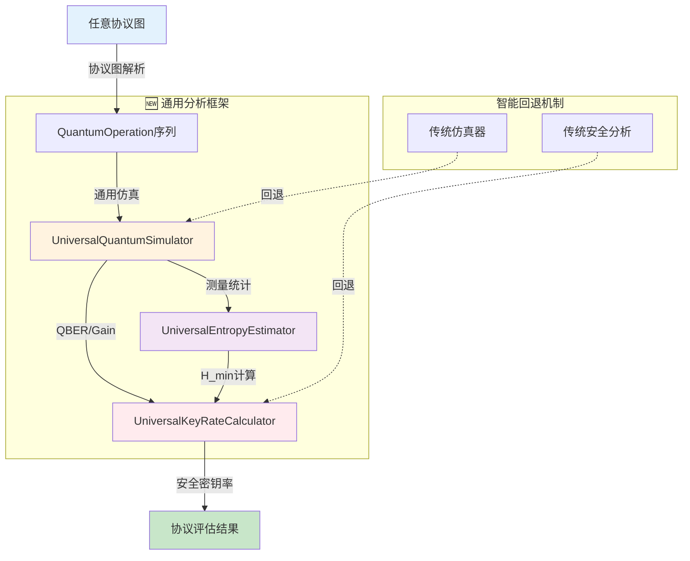
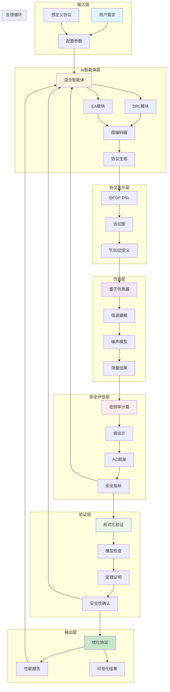

# AI辅助通用量子密钥分发（QKD）协议设计系统 v2.0

## 项目概述

**AI4QKD** 是一个基于量子信息论的通用QKD协议设计与分析系统，利用人工智能技术自动生成、优化和验证量子密钥分发协议。系统突破了传统QKD分析工具的协议特定限制，**支持任意创新协议的设计与安全性评估**。

### 🌟 核心特性

- **🚀 通用协议支持**：基于量子信息论基本原理，支持分析任意QKD协议结构，不限于BB84、MDI-QKD等预定义协议
- **🧠 AI协议创新**：结合深度强化学习和演化算法，自动探索未知的协议设计空间，发现性能更优的新协议
- **🔒 严格安全保证**：采用可组合安全性框架和有限密钥分析，确保协议在现实条件下的信息论安全
- **⚡ 智能回退机制**：通用框架与传统方法无缝集成，保证系统鲁棒性和向后兼容性
- **🎯 理论基础坚实**：基于Nielsen & Chuang、Wilde、Canetti等经典文献的量子信息论框架

### 版本 2.0.0 重大更新

- ✅ **通用协议仿真引擎**：支持协议无关的量子物理仿真
- ✅ **通用安全性分析器**：基于量子信息论的通用熵估计和密钥率计算  
- ✅ **扩展AI训练环境**：动作空间从4种扩展到6种，观察空间从64维扩展到128维
- ✅ **协议图到特征转换**：自动将任意协议图转换为QuantumOperation序列
- ✅ **完整向后兼容性**：现有代码无需修改即可使用新功能

## 项目架构

### 目录结构

```tree
AI4QKD/
├── README.md                           # 项目说明文档
├── requirements.txt                    # Python依赖包列表
├── setup.py                           # 项目安装配置
├── .cursor-rules.json                 # Cursor编辑器规则配置
├── main.py                            # 主程序入口
├── config/                            # 配置文件目录
│   ├── __init__.py
│   ├── settings.py                    # 全局配置参数
│   ├── qkd_protocols.py              # 预定义QKD协议配置
│   └── ai_agent_config.py            # AI智能体配置
├── qcgf_dsl/                          # 量子-经典图流DSL模块
│   ├── __init__.py
│   ├── protocol_graph.py             # 协议图核心数据结构
│   ├── node_types.py                 # 节点类型定义
│   ├── edge_types.py                 # 边类型定义
│   ├── parser.py                     # DSL解析器
│   ├── compiler.py                   # DSL编译器
│   └── visualizer.py                 # 协议图可视化
├── simulator/                         # 量子仿真器模块
│   ├── __init__.py
│   ├── universal_quantum_simulator.py # 🆕 通用协议仿真器
│   ├── quantum_simulator.py          # 主仿真器框架  
│   ├── real_quantum_simulator.py     # 核心物理过程仿真器
│   ├── state_preparation.py          # 量子态制备
│   ├── channel_model.py              # 量子信道建模
│   ├── noise_model.py                # 噪声模型
│   ├── measurement.py                # 量子测量实现
│   ├── qiskit_interface.py           # Qiskit接口封装
│   └── performance_metrics.py        # 性能指标计算
├── security_evaluator/                # 安全评估模块
│   ├── __init__.py
│   ├── key_rate_calculator.py        # 🆕 通用密钥率计算器
│   ├── entropy_estimator.py          # 🆕 通用熵估计器
│   ├── ac_framework.py               # AC抽象密码学框架
│   ├── finite_key_analysis.py        # 有限密钥分析
│   └── composable_security.py        # 可组合安全性
├── ai_agent/                          # AI智能体模块
│   ├── __init__.py
│   ├── environment.py                # 🆕 通用协议设计环境
│   ├── drl/                          # 深度强化学习
│   │   ├── __init__.py
│   │   ├── policy_network.py         # 策略网络
│   │   ├── value_network.py          # 价值网络
│   │   ├── sac_agent.py              # SAC智能体
│   │   ├── ppo_agent.py              # PPO智能体
│   │   └── replay_buffer.py          # 经验回放缓冲区
│   ├── ea/                           # 演化算法
│   │   ├── __init__.py
│   │   ├── genetic_algorithm.py      # 遗传算法
│   │   ├── evolution_strategy.py     # 演化策略
│   │   └── population.py             # 种群管理
│   ├── graph_encoder/                # 图编码器
│   │   ├── __init__.py
│   │   ├── gat_encoder.py            # 图注意力网络
│   │   ├── graph_transformer.py      # 图Transformer
│   │   └── graph_conv.py             # 图卷积网络
│   └── hybrid_agent.py               # 混合智能体
├── formal_verification/               # 形式化验证模块
│   ├── __init__.py
│   ├── protocol_verifier.py          # 协议验证器
│   ├── security_proof.py             # 安全性证明
│   ├── model_checker.py              # 模型检查器
│   └── theorem_prover.py             # 定理证明器
├── utils/                             # 工具函数模块
│   ├── __init__.py
│   ├── logger.py                     # 日志管理
│   ├── metrics.py                    # 性能指标
│   ├── data_processor.py             # 数据处理
│   └── visualization.py              # 可视化工具
├── tests/                             # 测试模块
│   ├── __init__.py
│   ├── test_qcgf_dsl.py             # DSL测试
│   ├── test_simulator.py             # 仿真器测试
│   ├── test_security_evaluator.py    # 安全评估测试
│   ├── test_ai_agent.py              # AI智能体测试
│   └── integration_test.py           # 集成测试
├── examples/                          # 示例代码
│   ├── __init__.py
│   ├── bb84_example.py               # BB84协议示例
│   ├── mdi_qkd_example.py            # MDI-QKD协议示例
│   ├── decoy_state_example.py        # 诱骗态协议示例
│   ├── custom_protocol_example.py    # 自定义协议示例
│   └── example_security_evaluator.py # 安全评估器独立使用示例
├── docs/                              # 文档目录
│   ├── architecture.md               # 架构文档
│   ├── api_reference.md              # API参考
│   ├── user_guide.md                 # 用户指南
│   └── development_guide.md          # 开发指南
├── devlog/                            # 开发日志与设计故事
├── logs/                              # 运行时日志
└── 方案文件/                          # 设计方案文档
    ├── AI辅助量子密钥分发（QKD）协议设计方案：基于双层抽象的生成与优化1.pdf
    ├── 人工智能辅助离散变量量子密钥分发协议设计综述.pdf
    ├── 第一部分.pdf
    ├── 第二部分.pdf
    ├── 第三部分.pdf
    ├── 第四部分.pdf
    └── 第五部分.pdf
```

## 快速开始

### 1. 环境安装

```bash
# 克隆项目
git clone <repository_url>
cd AI4QKD

# 创建虚拟环境
python -m venv venv
source venv/bin/activate  # Linux/Mac
# 或
venv\Scripts\activate     # Windows

# 安装依赖
pip install -r requirements.txt
```

### 2. 运行示例

#### 传统协议示例
```bash
# 运行BB84协议示例
python examples/bb84_example.py

# 运行MDI-QKD协议示例
python examples/mdi_qkd_example.py

# 运行诱骗态协议示例
python examples/decoy_state_example.py
```

#### 🆕 通用协议分析示例
```bash
# 使用通用仿真器分析任意协议
python -c "
from simulator import UniversalQuantumSimulator
from security_evaluator import UniversalKeyRateCalculator, UniversalEntropyEstimator
from qcgf_dsl import ProtocolGraph

# 创建任意协议图
protocol = ProtocolGraph()
protocol.add_node('qsp_1', 'QSP', {'state': '|+>', 'party': 'Alice'})
protocol.add_node('qc_1', 'QC', {'loss': 0.1, 'noise': 0.02})
protocol.add_node('qm_1', 'QM', {'basis': 'Z', 'party': 'Bob'})
protocol.add_edge('qsp_1', 'qc_1', 'quantum')
protocol.add_edge('qc_1', 'qm_1', 'quantum')

# 通用仿真和安全分析
simulator = UniversalQuantumSimulator()
key_calc = UniversalKeyRateCalculator()
entropy_est = UniversalEntropyEstimator()

# 获取分析结果
result = simulator.simulate(protocol)
key_rate = key_calc.calculate(result)
entropy = entropy_est.estimate(result)

print(f'密钥率: {key_rate:.4f} bits/pulse')
print(f'条件熵: {entropy:.4f} bits')
"
```

#### AI协议设计
```bash
# 启动AI辅助协议设计（使用通用环境）
python main.py --mode design

# 从检查点恢复训练
python main.py --resume_id experiment_001 --episode 100

# 运行测试
pytest tests/
```

### 3. 配置说明

主要配置文件位于 `config/settings.py`，包含：
- 量子仿真参数
- AI智能体超参数
- 安全评估阈值
- 可视化设置

## 模块功能说明

### 核心模块

| 模块 | 功能描述 | v2.0 新特性 |
|------|----------|-------------|
| **qcgf_dsl** | 量子-经典图流DSL，用于表示和操作QKD协议结构 | 支持任意协议图表示 |
| **simulator** | 🆕 **通用量子物理仿真**，支持协议无关的仿真 | UniversalQuantumSimulator |
| **security_evaluator** | 🆕 **通用安全评估**，基于量子信息论的安全分析 | UniversalKeyRateCalculator, UniversalEntropyEstimator |
| **ai_agent** | 🆕 **扩展AI智能体**，支持更复杂的协议创新 | QKDSimEnv, 6种动作类型, 128维观察空间 |
| **formal_verification** | 形式化验证，确保协议在最强攻击下的安全性 | - |

### 支持模块

| 模块 | 功能描述 |
|------|----------|
| **config** | 全局配置管理，包含各种参数设置 |
| **utils** | 通用工具函数，日志、指标、数据处理等 |
| **tests** | 单元测试和集成测试 |
| **examples** | 示例代码，展示系统使用方法 |
| **docs** | 项目文档和API参考 |

## 🆕 核心理论与实现：通用量子信息论框架

### 1. 从协议特定到协议无关的转变

传统QKD分析工具针对特定协议（如BB84、MDI-QKD）进行硬编码实现，无法适应AI生成的创新协议。**AI4QKD v2.0** 基于量子信息论的基本原理，构建了完全协议无关的通用分析框架。

#### 核心理论基础

- **量子信息论**：基于Nielsen & Chuang的经典教材，使用量子系统的密度矩阵表示和von Neumann熵
- **可组合安全性**：采用Canetti的通用可组合性框架，确保协议在任意环境下的安全性
- **有限密钥分析**：基于Tomamichel等人的工作，精确计算有限长度下的安全密钥率

### 2. 通用仿真引擎架构

#### QuantumOperation统一表示
```python
class QuantumOperation:
    def __init__(self, op_type, party, parameters):
        self.type = op_type        # 'state_prep', 'channel', 'measurement'
        self.party = party         # 'Alice', 'Bob', 'Charlie'
        self.params = parameters   # 操作特定参数
```

#### 协议图到特征转换
```python
def convert_protocol_to_features(protocol_graph):
    """将任意协议图转换为QuantumOperation序列"""
    operations = []
    for node in protocol_graph.nodes:
        if node.type == 'QSP':
            operations.append(QuantumOperation('state_prep', node.party, node.params))
        elif node.type == 'QC':
            operations.append(QuantumOperation('channel', None, node.params))
        elif node.type == 'QM':
            operations.append(QuantumOperation('measurement', node.party, node.params))
    return operations
```

### 3. 通用安全分析框架

#### 通用熵估计器
基于量子信息论的条件熵计算：
```python
class UniversalEntropyEstimator:
    def estimate_conditional_entropy(self, measurement_stats, error_rate):
        """计算 H(X|E) - Alice密钥相对于Eve的条件熵"""
        # 基于量子信息论的通用公式
        h_binary = self._binary_entropy(error_rate)
        return 1 - h_binary  # 对于qubit系统
```

#### 通用密钥率计算器
采用Devetak-Winter定理的推广形式：
```python
class UniversalKeyRateCalculator:
    def calculate_key_rate(self, simulation_result):
        """计算通用密钥率"""
        H_min = self.entropy_estimator.estimate_min_entropy(simulation_result)
        leakage = self._calculate_leakage(simulation_result)
        finite_corrections = self._calculate_finite_corrections(simulation_result)
        
        return max(0, H_min - leakage - finite_corrections)
```

### 4. 通用框架数据流



### 5. AI智能体扩展功能

#### 扩展动作空间（v2.0）
- **原有4种动作**：add_node, remove_node, add_edge, modify_params
- **🆕 新增2种动作**：reorganize_protocol（协议重组）, batch_optimize（批量优化）

#### 扩展观察空间（v2.0）
- **原64维特征**：基本协议图特征
- **🆕 128维特征**：包含量子信息论指标、拓扑特征、安全性度量等

#### 通用环境集成
```python
class QKDSimEnv:
    def __init__(self):
        self.universal_simulator = UniversalQuantumSimulator()
        self.universal_key_calc = UniversalKeyRateCalculator()
        self.universal_entropy_est = UniversalEntropyEstimator()
    
    def evaluate_protocol(self, protocol_graph):
        """评估任意协议的性能"""
        # 通用分析流程
        features = self.convert_protocol_to_features(protocol_graph)
        sim_result = self.universal_simulator.simulate(features)
        key_rate = self.universal_key_calc.calculate(sim_result)
        entropy = self.universal_entropy_est.estimate(sim_result)
        return {'key_rate': key_rate, 'entropy': entropy}
```

## 项目总数据流向图



## 模块间接口

### 数据交换格式

```python
# 协议图数据结构
protocol_graph = {
    "nodes": [
        {
            "id": "qsp_1",
            "type": "QSP",  # 量子态准备
            "params": {"state": "|0⟩", "party": "Alice"},
            "position": (x, y)
        },
        {
            "id": "qc_1", 
            "type": "QC",   # 量子信道
            "params": {"loss": 0.1, "noise": 0.01},
            "position": (x, y)
        }
    ],
    "edges": [
        {
            "source": "qsp_1",
            "target": "qc_1",
            "type": "quantum"
        }
    ]
}

# 仿真结果数据结构
simulation_result = {
    "protocol_id": "protocol_001",
    "key_rate": 0.85,  # bit/pulse
    "qber": 0.02,      # 量子比特错误率
    "security_parameter": 1e-10,
    "simulation_time": 120.5,
    "raw_key_length": 10000,
    "final_key_length": 8500
}

# 🆕 AI智能体扩展动作空间（v2.0）
action_space = {
    # 原有动作
    "add_node": {"type": "QSP|QC|QM|CLO|BSM", "params": dict},
    "remove_node": {"node_id": str},
    "add_edge": {"source": str, "target": str, "type": str},
    "modify_params": {"node_id": str, "params": dict},
    # 🆕 新增动作
    "reorganize_protocol": {"strategy": "topology|efficiency|security"},
    "batch_optimize": {"targets": ["key_rate", "error_rate"], "method": str}
}
```

## 🆕 通用API使用指南

#### 1. 通用仿真器API
```python
from simulator import UniversalQuantumSimulator

# 初始化通用仿真器
simulator = UniversalQuantumSimulator()

# 方式1：直接传入协议图
from qcgf_dsl import ProtocolGraph
protocol = ProtocolGraph()
# ... 构建协议图
result = simulator.simulate(protocol)

# 方式2：传入QuantumOperation序列
operations = [
    QuantumOperation('state_prep', 'Alice', {'state': '|+>'}),
    QuantumOperation('channel', None, {'loss': 0.1}),
    QuantumOperation('measurement', 'Bob', {'basis': 'Z'})
]
result = simulator.simulate_operations(operations)
```

#### 2. 通用安全分析API
```python
from security_evaluator import UniversalKeyRateCalculator, UniversalEntropyEstimator

# 通用密钥率计算
key_calc = UniversalKeyRateCalculator()
key_rate = key_calc.calculate(simulation_result)

# 通用熵估计
entropy_est = UniversalEntropyEstimator()
conditional_entropy = entropy_est.estimate_conditional_entropy(simulation_result)
min_entropy = entropy_est.estimate_min_entropy(simulation_result)
```

#### 3. 通用AI训练环境API
```python
from ai_agent import QKDSimEnv

# 初始化通用环境
env = QKDSimEnv()

# 环境特性（v2.0）
print(f"动作空间: {env.action_space}")  # 6种动作类型
print(f"观察空间: {env.observation_space}")  # 128维特征

# 训练循环
obs = env.reset()
for step in range(1000):
    action = env.action_space.sample()  # 随机动作
    obs, reward, done, info = env.step(action)
    if done:
        obs = env.reset()
```

## 🔄 向后兼容性说明

AI4QKD v2.0 完全向后兼容，现有代码无需修改：

```python
# 🆔 传统API（仍然有效）
from simulator import QuantumSimulator  # 自动映射到RealQuantumSimulator
from security_evaluator import KeyRateCalculator, EntropyEstimator
from ai_agent import HybridAgent

# 🆕 新通用API（推荐使用）
from simulator import UniversalQuantumSimulator
from security_evaluator import UniversalKeyRateCalculator, UniversalEntropyEstimator
from ai_agent import QKDSimEnv
```

## 主函数入口更新

### main.py - v2.0 增强版主程序

```python
#!/usr/bin/env python3
"""
AI辅助通用QKD协议设计系统主程序 v2.0
"""

import argparse
import logging
from config.settings import load_config
from qcgf_dsl.protocol_graph import ProtocolGraph

# 🆕 通用组件
from simulator import UniversalQuantumSimulator
from security_evaluator import UniversalKeyRateCalculator, UniversalEntropyEstimator
from ai_agent import QKDSimEnv, HybridAgent

# 传统组件（向后兼容）
from formal_verification.protocol_verifier import ProtocolVerifier
from utils.logger import setup_logger

def main():
    """主函数"""
    parser = argparse.ArgumentParser(description='AI辅助通用QKD协议设计系统 v2.0')
    parser.add_argument('--mode', choices=['design', 'evaluate', 'optimize'], 
                       default='design', help='运行模式')
    parser.add_argument('--universal', action='store_true', 
                       help='使用通用分析框架（推荐）')
    parser.add_argument('--resume_id', help='恢复训练的运行ID')
    parser.add_argument('--episode', type=int, help='恢复训练的回合数')
    
    args = parser.parse_args()
    
    # 设置日志
    setup_logger()
    logger = logging.getLogger(__name__)
    
    # 加载配置
    config = load_config()
    
    if args.universal or args.mode == 'design':
        # 🆕 使用通用框架
        logger.info("使用通用分析框架...")
        env = QKDSimEnv()
        simulator = UniversalQuantumSimulator()
        key_calc = UniversalKeyRateCalculator()
        entropy_est = UniversalEntropyEstimator()
    else:
        # 传统框架（向后兼容）
        from simulator import QuantumSimulator
        from security_evaluator import KeyRateCalculator
        simulator = QuantumSimulator()
        key_calc = KeyRateCalculator()
    
    ai_agent = HybridAgent(config)
    verifier = ProtocolVerifier(config)
    
    if args.mode == 'design':
        logger.info("开始AI辅助协议设计（通用环境）...")
        # 使用通用环境进行协议创新
        designed_protocols = ai_agent.design_protocol_universal(env)
        
        for protocol in designed_protocols:
            # 通用安全性评估
            sim_result = simulator.simulate(protocol)
            key_rate = key_calc.calculate(sim_result) 
            entropy = entropy_est.estimate(sim_result)
            
            logger.info(f"协议密钥率: {key_rate:.4f}, 条件熵: {entropy:.4f}")
            
    elif args.mode == 'evaluate':
        logger.info("开始通用协议评估...")
        # 实现通用协议评估逻辑
        
    elif args.mode == 'optimize':
        logger.info("开始通用协议优化...")
        # 实现通用协议优化逻辑

if __name__ == "__main__":
    main()
```

## 依赖库列表

### 核心依赖

```txt
# 量子计算框架
qiskit>=0.44.0                    # IBM量子计算框架
qutip>=4.7.0                      # 量子光学仿真
cirq>=1.2.0                       # Google量子计算框架

# 深度学习框架
torch>=2.0.0                      # PyTorch深度学习框架
torch-geometric>=2.3.0            # 图神经网络
transformers>=4.30.0              # Transformer模型

# 强化学习
stable-baselines3>=2.0.0          # 强化学习算法库
gymnasium>=0.29.0                 # 强化学习环境

# 图处理
networkx>=3.1                      # 图数据结构
matplotlib>=3.7.0                 # 图形可视化
plotly>=5.15.0                    # 交互式可视化

# 科学计算
numpy>=1.24.0                     # 数值计算
scipy>=1.10.0                     # 科学计算
pandas>=2.0.0                     # 数据处理

# 密码学
cryptography>=41.0.0              # 密码学库
pycryptodome>=3.18.0              # 密码学工具

# 形式化验证
z3-solver>=4.12.0                 # SMT求解器
sympy>=1.12.0                     # 符号计算

# 工具库
tqdm>=4.65.0                      # 进度条
pyyaml>=6.0                       # YAML配置
click>=8.1.0                      # 命令行工具
```

### 开发依赖

```txt
# 测试框架
pytest>=7.4.0                     # 测试框架
pytest-cov>=4.1.0                 # 测试覆盖率
pytest-mock>=3.11.0               # 测试模拟

# 代码质量
black>=23.7.0                     # 代码格式化
flake8>=6.0.0                     # 代码检查
mypy>=1.5.0                       # 类型检查

# 文档生成
sphinx>=7.1.0                     # 文档生成
sphinx-rtd-theme>=1.3.0           # 文档主题

# 开发工具
jupyter>=1.0.0                    # Jupyter笔记本
ipython>=8.14.0                   # 交互式Python
```

## 贡献指南

1. Fork项目
2. 创建功能分支 (`git checkout -b feature/AmazingFeature`)
3. 提交更改 (`git commit -m 'Add some AmazingFeature'`)
4. 推送到分支 (`git push origin feature/AmazingFeature`)
5. 开启Pull Request

## 许可证

本项目采用MIT许可证 - 详见 [LICENSE](LICENSE) 文件

## 联系方式

- 项目维护者：[您的姓名]
- 邮箱：[您的邮箱]
- 项目链接：[GitHub链接]

---

*本文档基于AI辅助量子密钥分发协议设计方案生成，详细技术方案请参考 `方案文件/` 目录下的相关文档。*