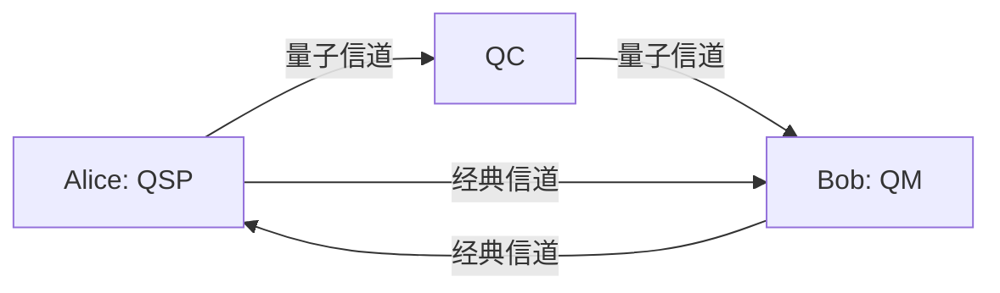

# AI4QKD 用户指南

## 🎯 目标读者

本指南面向以下用户：
- 量子密码学研究人员
- QKD协议设计者
- AI与量子技术交叉领域的学生和研究者
- 对自动化协议设计感兴趣的开发者

**⚠️ 重构状态提醒**: 项目当前在 `clean-start-v3` 分支进行完全重构，本指南将随重构进度逐步更新。目前可用的是 qcgf_dsl 模块的完整功能。

## 📋 前置要求

### 系统要求
- **操作系统**: Windows 10+, macOS 10.14+, Linux (Ubuntu 18.04+)
- **Python版本**: 3.8 或更高
- **内存**: 至少 4GB RAM
- **存储**: 至少 2GB 可用空间

### 必备知识
- **量子密码学基础**: 了解BB84协议和QKD基本概念
- **离散变量QKD**: 理解DV-QKD与CV-QKD的技术差异
- **Python编程**: 基本的Python语法和数据结构
- **线性代数**: 量子态和量子操作的数学基础
- **图论**: 理解有向图和网络结构

### 技术背景 (重要)

**AI4QKD专注于离散变量量子密钥分发（DV-QKD）**：

#### DV-QKD vs CV-QKD 技术差异

| 技术特征 | 离散变量QKD (DV-QKD) | 连续变量QKD (CV-QKD) |
|----------|---------------------|---------------------|
| **量子态** | 离散态（\|0⟩, \|1⟩, \|+⟩, \|-⟩） | 连续态（相干态、压缩态） |
| **编码方式** | 偏振、相位、时分编码 | 相位/振幅调制 |
| **测量技术** | 单光子探测器(SPD) | 零差/外差检测 |
| **判决方式** | 探测器点击模式 | 阈值判决 |
| **成熟度** | 技术成熟，商用化 | 研究阶段 |
| **距离** | 长距离传输优势 | 短距离高速率 |

#### 为什么选择DV-QKD？

1. **技术成熟**: DV-QKD技术已经商用化，有完整的硬件生态
2. **长距离优势**: 更适合实际的量子通信网络部署
3. **安全性验证**: 理论安全性和实际实现都有充分验证
4. **标准化**: 有完整的国际标准和行业规范

**⚠️ 重要说明**: 本项目不支持连续变量QKD技术。所有参数、算法和协议都基于离散量子态设计。

## 🚀 快速开始

### 1. 环境设置

#### 使用Conda（推荐）

```bash
# 克隆仓库
git clone https://github.com/RoyalTeng/AI4QKD.git
cd AI4QKD

# 激活预配置环境
conda activate ai4qkd_env

# 验证安装
python -c "from qcgf_dsl import *; print('✅ 安装成功')"
```

#### 手动安装

```bash
# 创建虚拟环境
python -m venv ai4qkd_env
source ai4qkd_env/bin/activate  # Linux/macOS
# 或
ai4qkd_env\Scripts\activate     # Windows

# 安装依赖
pip install -r requirements.txt
```

### 2. 第一个协议

创建并运行您的第一个BB84协议：

```python
# 导入qcgf_dsl模块
from qcgf_dsl import *

# 创建BB84协议
print("🔬 创建BB84协议...")
bb84 = create_bb84_protocol()

# 查看协议信息
print(f"✅ 协议创建成功: {bb84.name}")
print(f"   - 节点数量: {bb84.get_node_count()}")
print(f"   - 边数量: {bb84.get_edge_count()}")

# 获取详细统计
stats = bb84.get_statistics()
print(f"   - 节点类型: {stats['node_stats']}")
print(f"   - 参与者: {stats['party_stats']}")
```

### 3. 验证安装

```python
# 运行快速测试
python test_refactor.py
```

如果看到"🎉 qcgf_dsl模块基本功能测试全部通过！"，说明安装成功。

## 📚 核心概念

### 协议图表示

AI4QKD使用**协议图**来表示QKD协议：

```
QKD协议 = 有向图(节点, 边)
```

- **节点**: 表示操作（量子态准备、测量、经典处理）
- **边**: 表示通信链路（量子信道、经典信道）
- **参数**: 每个节点和边都有物理参数

#### 示例：BB84协议结构



### 节点类型

#### 量子节点
- **QSP**: 量子态准备 - 制备量子比特
- **QM**: 量子测量 - 测量量子态
- **QG**: 量子门 - 量子态变换
- **QC**: 量子信道 - 传输量子信息
- **QD**: 量子检测器 - 检测量子信号
- **BSM**: 贝尔态测量 - 纠缠态投影测量

#### 经典节点
- **CLO**: 经典逻辑操作 - 数据处理
- **CS**: 经典存储 - 信息存储
- **CC**: 经典信道 - 传输经典信息

#### 特殊节点
- **ATTACK**: 攻击节点 - 安全分析用
- **SINK**: 汇聚节点 - 收集输出

### 参与者角色

- **Alice**: 发送方，通常负责量子态准备
- **Bob**: 接收方，通常负责量子测量
- **Eve**: 窃听者，用于安全性分析
- **Charlie**: 第三方，如MDI-QKD中的测量方

## 🛠️ 基本使用

### 创建协议图

#### 方法1：从零开始构建

```python
# 创建空协议图
protocol = ProtocolGraph("我的协议")

# 添加Alice的量子态准备节点
alice_qsp = protocol.add_node(
    NodeType.QSP,
    party=Party.ALICE,
    params={
        "state": "|0⟩",      # 初始量子态
        "fidelity": 0.99,    # 制备保真度
        "preparation_time": 1e-9  # 制备时间
    }
)

# 添加量子信道
quantum_channel = protocol.add_node(
    NodeType.QC,
    params={
        "loss": 0.1,         # 信道损耗
        "distance": 50.0,    # 传输距离(km)
        "noise": 0.01        # 噪声水平
    }
)

# 添加Bob的量子测量节点
bob_qm = protocol.add_node(
    NodeType.QM,
    party=Party.BOB,
    params={
        "basis": "computational",  # 测量基
        "efficiency": 0.8,         # 检测效率
        "dark_count_rate": 1e-6    # 暗计数率
    }
)

# 连接节点
protocol.add_edge(alice_qsp, quantum_channel, EdgeType.QUANTUM)
protocol.add_edge(quantum_channel, bob_qm, EdgeType.QUANTUM)

# 添加经典通信
protocol.add_edge(alice_qsp, bob_qm, EdgeType.CLASSICAL)

print(f"✅ 协议创建完成：{protocol}")
```

#### 方法2：使用预定义模板

```python
# 快速创建标准协议
bb84 = create_bb84_protocol()
mdi_qkd = create_mdi_qkd_protocol()

# 查看协议结构
for node in bb84.get_all_nodes():
    print(f"节点: {node.node_id} ({node.node_type.value})")
    if node.party:
        print(f"  参与者: {node.party.value}")
    print(f"  描述: {node.get_description()}")
```

### 协议操作

#### 查找和修改节点

```python
# 按类型查找节点
qsp_nodes = protocol.get_nodes_by_type(NodeType.QSP)
print(f"找到 {len(qsp_nodes)} 个量子态准备节点")

# 按参与者查找节点
alice_nodes = protocol.get_nodes_by_party(Party.ALICE)
print(f"Alice 控制 {len(alice_nodes)} 个节点")

# 获取特定节点
node = protocol.get_node(alice_qsp)
if node:
    print(f"节点状态: {node.get_param('state')}")
    
    # 修改节点参数
    node.set_param("fidelity", 0.995)
    print(f"新保真度: {node.get_param('fidelity')}")
```

#### 协议分析

```python
# 检查协议有效性
if protocol.is_dag():
    print("✅ 协议是有向无环图")
else:
    print("❌ 协议包含环路，需要修正")

# 获取拓扑排序
try:
    topo_order = protocol.get_topological_order()
    print(f"执行顺序: {' -> '.join(topo_order)}")
except ValueError as e:
    print(f"拓扑排序失败: {e}")

# 详细统计信息
stats = protocol.get_statistics()
print(f"""
📊 协议统计:
  - 总节点数: {stats['node_count']}
  - 总边数: {stats['edge_count']}
  - 图密度: {stats['density']:.3f}
  - 平均度数: {stats['avg_degree']:.2f}
  
📈 节点分布:
""")
for node_type, count in stats['node_stats'].items():
    print(f"  - {node_type}: {count}")

print("\n👥 参与者分布:")
for party, count in stats['party_stats'].items():
    print(f"  - {party}: {count}")
```

### 理想化模式

AI4QKD支持两种操作模式：

#### 理想化研究模式

```python
# 切换到理想化模式
setup_idealized_research_mode()

# 在理想化模式下创建节点
ideal_qm = protocol.add_node(
    NodeType.QM,
    party=Party.BOB
)

# 检查理想化参数
node = protocol.get_node(ideal_qm)
print(f"理想化检测效率: {node.get_param('efficiency')}")  # 1.0
print(f"理想化暗计数: {node.get_param('dark_count_rate')}")  # 0.0
```

#### 现实部署模式

```python
# 切换到现实模式
setup_realistic_deployment_mode()

# 现实模式下的参数更加保守
realistic_qm = protocol.add_node(
    NodeType.QM,
    party=Party.BOB
)

node = protocol.get_node(realistic_qm)
print(f"现实检测效率: {node.get_param('efficiency')}")  # 0.8
print(f"现实暗计数: {node.get_param('dark_count_rate')}")  # 1e-6
```

#### 参数对比分析

```python
# 比较两种模式的参数差异
comparison = compare_mode_parameters(NodeType.QM)

print("🔍 模式参数对比:")
for diff in comparison['differences']:
    print(f"  {diff['parameter']}: {diff['realistic']} → {diff['idealized']} ({diff['improvement']})")
```

## 💾 文件操作

### 保存和加载协议

#### JSON格式（推荐）

```python
# 保存为JSON
save_protocol_to_file(protocol, "my_protocol.json", format_type="json")

# 从JSON加载
loaded_protocol = load_protocol_from_file("my_protocol.json")
print(f"加载协议: {loaded_protocol.name}")
```

#### DSL文本格式

```python
# 保存为DSL文本
save_protocol_to_file(protocol, "my_protocol.qcgf", format_type="dsl")

# 从DSL文本加载
dsl_protocol = load_protocol_from_file("my_protocol.qcgf")
```

#### 手动序列化

```python
# 序列化为字符串
serializer = QCGFSerializer()
dsl_text = serializer.serialize(protocol)
print("DSL文本:")
print(dsl_text)

# 从字符串解析
parser = QCGFParser()
parsed_protocol = parser.parse(dsl_text)
```

### 文件格式说明

#### JSON格式特点
- ✅ 包含完整的节点和边信息
- ✅ 支持复杂的参数结构
- ✅ 易于程序处理
- ❌ 文件较大，不易人工阅读

#### DSL格式特点
- ✅ 人类可读的文本格式
- ✅ 简洁的协议描述
- ✅ 便于版本控制
- ❌ 可能丢失部分元数据

## 🎨 协议可视化

### 基本可视化

```python
# 快速可视化
visualize_protocol(protocol)

# 保存图像
visualizer = ProtocolVisualizer()
visualizer.save_visualization(protocol, "my_protocol.png")
```

### 自定义可视化

```python
# 自定义可视化参数
visualize_protocol(
    protocol,
    layout='spring',           # 布局算法
    node_size=1000,           # 节点大小
    node_color_by='party',    # 按参与者着色
    show_labels=True,         # 显示标签
    figsize=(12, 8)          # 图像尺寸
)
```

## 🧪 实验和测试

### 运行测试套件

```bash
# 运行所有测试
python -m pytest tests/ -v

# 运行特定测试
python -m pytest tests/test_qcgf_dsl_refactor.py -v

# 快速功能验证
python test_refactor.py
```

### 性能基准测试

```python
import time

# 测试协议创建性能
start_time = time.time()
for i in range(100):
    protocol = create_bb84_protocol()
creation_time = time.time() - start_time
print(f"100次BB84创建用时: {creation_time:.3f}秒")

# 测试大型协议性能
large_protocol = ProtocolGraph("Large_Protocol")
start_time = time.time()
for i in range(1000):
    large_protocol.add_node(NodeType.QSP)
addition_time = time.time() - start_time
print(f"1000个节点添加用时: {addition_time:.3f}秒")
```

## 🔧 高级功能

### 协议合并

```python
# 创建两个协议
protocol1 = create_bb84_protocol()
protocol2 = create_mdi_qkd_protocol()

# 合并协议
merged = protocol1.merge(protocol2, prefix="mdi")
print(f"合并后协议节点数: {merged.get_node_count()}")
```

### 协议克隆

```python
# 克隆协议进行实验
original = create_bb84_protocol()
experiment = original.clone()

# 修改实验协议
experiment.name = "实验版BB84"
for node in experiment.get_nodes_by_type(NodeType.QSP):
    node.set_param("fidelity", 0.999)
```

### 自定义节点参数

```python
# 获取并修改默认模板
template = get_node_template(NodeType.QSP)
print("默认QSP参数:", template)

# 创建自定义参数
custom_params = {
    "state": "α|0⟩ + β|1⟩",  # 自定义叠加态
    "fidelity": 0.995,
    "preparation_time": 5e-10,
    "custom_property": "特殊值"
}

# 使用自定义参数创建节点
custom_qsp = protocol.add_node(
    NodeType.QSP,
    party=Party.ALICE,
    params=custom_params
)
```

## 🚨 故障排除

### 常见错误和解决方案

#### 1. 环境问题

```python
# 错误: ModuleNotFoundError: No module named 'qcgf_dsl'
# 解决: 确保激活了正确的环境
conda activate ai4qkd_env
```

#### 2. 参数验证错误

```python
# 错误: ValueError: Invalid parameters for node type QM
try:
    protocol.add_node(
        NodeType.QM,
        params={"efficiency": 1.5}  # 错误：效率不能超过1.0
    )
except ValueError as e:
    print(f"参数错误: {e}")
    
    # 正确做法：使用有效参数
    protocol.add_node(
        NodeType.QM,
        params={"efficiency": 0.95}  # 正确：0 <= 效率 <= 1
    )
```

#### 3. 环路检测

```python
# 错误: 添加边会形成环路
node1 = protocol.add_node(NodeType.QSP)
node2 = protocol.add_node(NodeType.QM)

protocol.add_edge(node1, node2, EdgeType.QUANTUM)

try:
    protocol.add_edge(node2, node1, EdgeType.QUANTUM)  # 这会形成环路
except ValueError as e:
    print(f"环路错误: {e}")
```

#### 4. 文件操作问题

```python
# 错误: 文件路径不存在
try:
    protocol = load_protocol_from_file("不存在的文件.json")
except IOError as e:
    print(f"文件错误: {e}")
    
    # 解决：检查文件是否存在
    import os
    if os.path.exists("my_protocol.json"):
        protocol = load_protocol_from_file("my_protocol.json")
    else:
        print("文件不存在，创建新协议")
        protocol = create_bb84_protocol()
```

### 调试技巧

#### 1. 启用详细输出

```python
# 查看协议详细信息
def debug_protocol(protocol):
    print(f"=== 协议调试信息: {protocol.name} ===")
    print(f"节点数: {protocol.get_node_count()}")
    print(f"边数: {protocol.get_edge_count()}")
    print(f"是否为DAG: {protocol.is_dag()}")
    
    print("\n节点列表:")
    for node in protocol.get_all_nodes():
        print(f"  {node.node_id}: {node.node_type.value}")
        if node.party:
            print(f"    参与者: {node.party.value}")
        print(f"    参数数量: {len(node.params)}")
    
    print("\n边列表:")
    for source, target, data in protocol.get_edges():
        edge_type = data.get('edge_type', 'unknown')
        print(f"  {source} -> {target} ({edge_type})")

debug_protocol(bb84)
```

#### 2. 参数检查

```python
def check_node_params(node):
    print(f"节点 {node.node_id} 参数检查:")
    for key, value in node.params.items():
        print(f"  {key}: {value} ({type(value).__name__})")
    
    # 检查关键参数
    if node.node_type == NodeType.QM:
        efficiency = node.get_param('efficiency', 0)
        if efficiency > 1.0:
            print(f"  ⚠️  警告: 检测效率 {efficiency} 超过1.0")
        elif efficiency < 0:
            print(f"  ❌ 错误: 检测效率 {efficiency} 小于0")
        else:
            print(f"  ✅ 检测效率正常: {efficiency}")
```

## 📈 性能优化

### 1. 批量操作优化

```python
# 不推荐：频繁的统计更新
protocol = ProtocolGraph("慢速协议")
for i in range(1000):
    protocol.add_node(NodeType.QSP)  # 每次都会更新统计

# 推荐：批量操作
protocol = ProtocolGraph("快速协议")
protocol._stats_dirty = False  # 暂时禁用统计更新
for i in range(1000):
    protocol.add_node(NodeType.QSP)
protocol._stats_dirty = True  # 重新启用统计更新
```

### 2. 内存使用优化

```python
# 大型协议的内存管理
def create_large_protocol():
    protocol = ProtocolGraph("大型协议")
    
    # 使用节点ID而不是保存节点对象引用
    node_ids = []
    for i in range(10000):
        node_id = protocol.add_node(NodeType.QSP)
        node_ids.append(node_id)
    
    return protocol, node_ids

# 清理不需要的协议
del protocol  # 释放内存
```

## 📚 进阶主题

### 自定义协议设计模式

#### 1. 层次化协议构建

```python
def build_layered_protocol():
    """构建分层的复杂协议"""
    protocol = ProtocolGraph("分层协议")
    
    # 第一层：量子态准备
    prep_nodes = []
    for i in range(3):
        node_id = protocol.add_node(
            NodeType.QSP,
            party=Party.ALICE,
            params={"state": f"|{i}⟩"}
        )
        prep_nodes.append(node_id)
    
    # 第二层：量子处理
    processing_node = protocol.add_node(
        NodeType.QG,
        params={"gate_type": "CNOT"}
    )
    
    # 第三层：测量
    measure_nodes = []
    for i in range(2):
        node_id = protocol.add_node(
            NodeType.QM,
            party=Party.BOB,
            params={"basis": "hadamard" if i == 0 else "computational"}
        )
        measure_nodes.append(node_id)
    
    # 连接各层
    for prep_node in prep_nodes:
        protocol.add_edge(prep_node, processing_node, EdgeType.QUANTUM)
    
    for measure_node in measure_nodes:
        protocol.add_edge(processing_node, measure_node, EdgeType.QUANTUM)
    
    return protocol
```

#### 2. 参数化协议生成

```python
def create_parameterized_bb84(distance=50, fidelity=0.99, efficiency=0.8):
    """创建参数化的BB84协议"""
    protocol = ProtocolGraph(f"BB84_d{distance}_f{fidelity}_e{efficiency}")
    
    # 根据距离计算损耗
    loss = 1 - 10**(-0.2 * distance / 10)  # 光纤损耗公式
    
    alice_qsp = protocol.add_node(
        NodeType.QSP,
        party=Party.ALICE,
        params={"state": "|0⟩", "fidelity": fidelity}
    )
    
    channel = protocol.add_node(
        NodeType.QC,
        params={"loss": loss, "distance": distance}
    )
    
    bob_qm = protocol.add_node(
        NodeType.QM,
        party=Party.BOB,
        params={"efficiency": efficiency}
    )
    
    protocol.add_edge(alice_qsp, channel, EdgeType.QUANTUM)
    protocol.add_edge(channel, bob_qm, EdgeType.QUANTUM)
    
    return protocol

# 生成不同参数的协议族
protocols = []
for distance in [10, 50, 100]:
    for fidelity in [0.95, 0.99]:
        protocol = create_parameterized_bb84(distance, fidelity)
        protocols.append(protocol)

print(f"生成了 {len(protocols)} 个参数化协议")
```

## 🎓 学习路径

### 初学者路径（1-2周）

1. **理解基础概念**
   - 阅读量子密码学基础
   - 学习协议图表示方法
   - 运行基本示例

2. **练习基本操作**
   - 创建简单协议
   - 修改节点参数
   - 保存和加载协议

3. **探索预定义协议**
   - 分析BB84协议结构
   - 理解MDI-QKD协议
   - 比较不同协议特点

### 中级用户路径（2-4周）

1. **自定义协议设计**
   - 设计新的协议变体
   - 实验不同参数组合
   - 验证协议有效性

2. **高级功能使用**
   - 协议合并和克隆
   - 理想化模式切换
   - 性能优化技巧

3. **集成其他工具**
   - 与可视化工具结合
   - 与仿真器集成
   - 数据分析和处理

### 高级用户路径（1-2个月）

1. **扩展框架功能**
   - 自定义节点类型
   - 实现新的验证规则
   - 开发专用工具

2. **研究应用**
   - 设计创新协议
   - 性能基准测试
   - 学术论文撰写

3. **贡献开源项目**
   - 提交bug报告
   - 贡献代码改进
   - 参与社区讨论

## 📞 获取帮助

### 文档资源
- **API参考**: [API_REFERENCE.md](API_REFERENCE.md)
- **开发指南**: [DEVELOPMENT_GUIDE.md](DEVELOPMENT_GUIDE.md)
- **示例代码**: [../examples/](../examples/)

### 社区支持
- **GitHub Issues**: https://github.com/RoyalTeng/AI4QKD/issues
- **讨论区**: https://github.com/RoyalTeng/AI4QKD/discussions
- **邮件支持**: [支持邮箱]

### 学术合作
如果您在研究中使用AI4QKD，我们欢迎学术合作和交流。请联系研究团队讨论合作机会。

---

**🌟 恭喜！您已经掌握了AI4QKD的基本使用方法。现在可以开始探索量子协议设计的无限可能！**