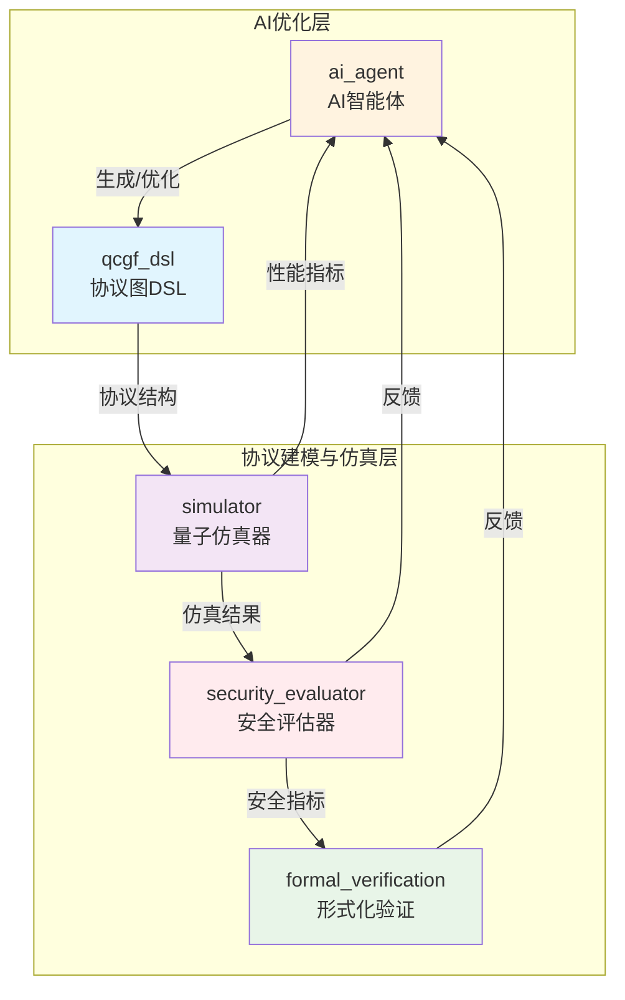
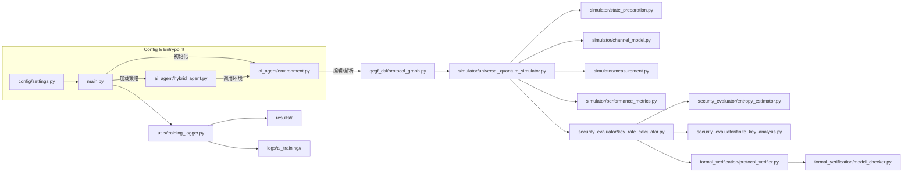

> 本文档适用于开发者和研究者快速理解 AI4QKD 系统的整体架构与模块协作方式。 

# AI4QKD 系统架构文档

## 一、系统总体架构图

---

## 二、模块职责说明

### 1. ai_agent（AI智能体）
- **职责**：基于深度强化学习（DRL）、演化算法（EA）等方法，自动生成、优化QKD协议结构。
- **输入**：协议设计目标、历史仿真与安全评估数据。
- **输出**：协议图（QCGF DSL表示）、优化建议。
- **调用关系**：调用 qcgf_dsl 生成协议结构，接收 simulator 和 security_evaluator 的反馈。

### 2. qcgf_dsl（量子-经典图流DSL）
- **职责**：协议结构的图模型表达、解析、可视化与编译。
- **输入**：AI智能体生成的协议结构描述。
- **输出**：协议图数据结构，供仿真与评估模块调用。
- **调用关系**：被 ai_agent 调用生成协议，被 simulator 解析执行。

### 3. simulator（量子仿真器）
- **职责**：对协议图进行物理层仿真，输出性能指标（如QBER、密钥率等）。
- **输入**：协议图（QCGF DSL）、物理参数、仿真配置。
- **输出**：仿真结果、性能指标。
- **调用关系**：被 ai_agent、security_evaluator 调用，向 ai_agent 反馈性能。

### 4. security_evaluator（安全评估器）
- **职责**：基于仿真结果，计算协议的安全性指标（密钥率、熵、可组合安全参数等）。
- **输入**：仿真结果、协议参数。
- **输出**：安全性评估报告、安全参数。
- **调用关系**：被 simulator、ai_agent 调用，向 ai_agent 反馈安全性。

### 5. formal_verification（形式化验证）
- **职责**：对协议进行理论安全性证明、模型检查和定理验证。
- **输入**：协议结构、安全评估结果。
- **输出**：安全性证明、验证结论。
- **调用关系**：被 ai_agent 调用，向 ai_agent 反馈验证结论。

---

## 三、数据流与调用顺序

1. **AI智能体（ai_agent）** 生成协议结构，调用 qcgf_dsl 构建协议图。
2. **协议图（qcgf_dsl）** 作为输入，传递给 simulator 进行物理仿真。
3. **simulator** 输出仿真性能指标，传递给 security_evaluator 进行安全性评估。
4. **security_evaluator** 输出安全性参数，供 ai_agent 优化决策。
5. **formal_verification** 可对协议和安全性结果进行理论验证，进一步反馈给 ai_agent。
6. **反馈循环**：ai_agent 根据仿真与评估结果持续优化协议结构，实现自动化迭代。

---

## 四、设计理念与可扩展性说明

### 1. 双层抽象结构设计
- **协议图构建层**：通过 QCGF DSL 实现协议结构的统一抽象与表达，便于多种协议的灵活建模与可视化。
- **AI优化层**：通过 AI 智能体自动探索、优化协议结构，实现数据驱动的协议创新。

### 2. 解耦与耦合关系
- **解耦**：
  - 各模块通过协议图和标准化数据结构交互，便于独立开发与测试。
  - AI优化与物理仿真、安全评估、形式化验证分层实现，互不干扰。
- **耦合**：
  - 协议图（qcgf_dsl）是各模块的核心纽带，所有核心流程均围绕协议图展开。

### 3. 可扩展性
- 支持新增协议类型、物理模型、AI优化算法、评估方法等。
- 各子系统接口清晰，便于集成第三方工具或替换实现。
- 适合科研探索与工程落地的双重需求。

---

## 五、关键运行流程细化

### 1. AI 驱动的协议搜索闭环
- **训练启动**：`main.py` 读取 `config/settings.py` 等配置，初始化 `QKDSimEnv`（环境）与 `HybridAgent`（混合智能体）。
- **协议生成与编辑**：`ai_agent/environment.py` 暴露 6 种动作（结构重组、参数优化等），驱动 `qcgf_dsl/protocol_graph.py` 产生或修改协议节点/边。
- **仿真与指标计算**：`simulator/universal_quantum_simulator.py` 解析协议图，调用 `state_preparation.py`、`channel_model.py`、`measurement.py` 等物理子模块生成 QBER、增益等指标。
- **安全评估**：`security_evaluator/key_rate_calculator.py` 联合 `entropy_estimator.py`、`finite_key_analysis.py` 计算密钥率与可组合安全参数。
- **形式化反馈**：如需理论检查，`formal_verification/protocol_verifier.py` 与 `model_checker.py` 读取协议图/评估结果，生成验证反馈。
- **日志与持久化**：`utils/training_logger.py` 将每回合的动作、奖励、模型权重写入 `results/<run_id>/` 与 `logs/ai_training/<run_id>/`，支持 `--resume_id` 恢复。

### 2. 经典协议运行路径（示例脚本）
- `examples/bb84_example.py`、`examples/mdi_qkd_example.py` 等直接构造预置协议图（或调用配置），通过 `universal_quantum_simulator.py` 计算性能，再交由 `key_rate_calculator.py` 得到密钥率；不进入 AI 训练循环。

### 3. 独立安全评估路径
- `examples/example_security_evaluator.py` 展示仅使用 `security_evaluator` 模块的方式：外部提供协议特征/仿真结果即可获得安全参数，便于与第三方仿真器集成。

---

## 六、核心模块间的依赖关系（文件级）

---

## 七、配置、结果与可视化
- **配置中心**：`config/settings.py` 定义训练与仿真超参，`config/ai_agent_config.py`、`config/qkd_protocols.py` 补充协议与智能体细节；命令行参数（如 `--resume_id`、`--episode`、`--run_id`）在 `main.py` 中解析并覆盖默认配置。
- **结果产出**：训练产生的检查点位于 `results/<run_id>/best|latest|episodes/`，动作/奖励日志位于 `logs/ai_training/<run_id>/`，示例脚本输出直接在控制台或 `logs/` 下生成记录。
- **可视化**：`qcgf_dsl/visualizer.py` 支持协议图渲染，`utils/visualization.py` 提供指标绘制；在训练或仿真后可用于生成协议结构图或性能曲线。

---

## 八、扩展与集成建议
- **新增协议原语**：在 `qcgf_dsl/node_types.py`、`edge_types.py` 定义新节点/边类型，并扩展 `protocol_graph.py` 的解析与验证逻辑。
- **物理模型替换**：在 `simulator/` 下添加自定义信道/噪声/测量模块，并在 `universal_quantum_simulator.py` 注册入口；保持接口返回标准化性能指标以兼容安全评估。
- **AI 算法扩展**：在 `ai_agent/drl/` 或 `ai_agent/ea/` 添加新智能体，实现与 `HybridAgent` 的策略融合或替换；确保环境动作/奖励空间一致。
- **验证流程增强**：向 `formal_verification/` 添加新的模型检查或定理证明器，实现更严格的安全性保证。

---

