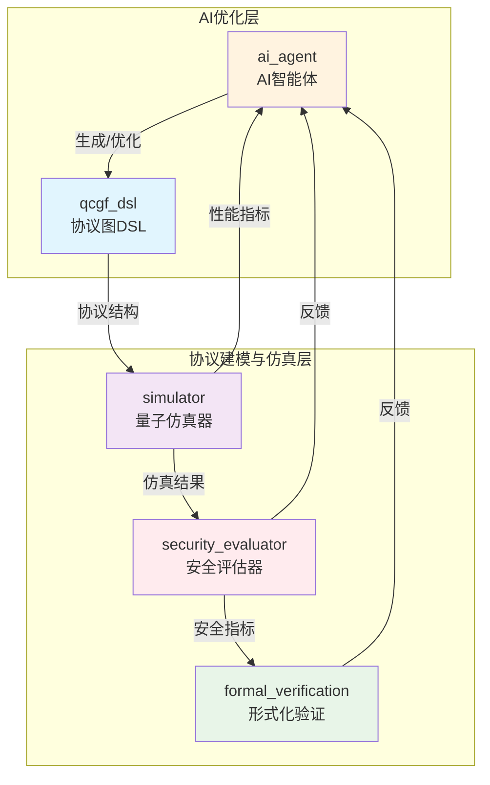

> 本文档适用于开发者和研究者快速理解 AI4QKD 系统的整体架构与模块协作方式。 

# AI4QKD 系统架构文档

## 一、系统总体架构图

---

## 二、模块职责说明

### 1. ai_agent（AI智能体）
- **职责**：基于深度强化学习（DRL）、演化算法（EA）等方法，自动生成、优化QKD协议结构。
- **输入**：协议设计目标、历史仿真与安全评估数据。
- **输出**：协议图（QCGF DSL表示）、优化建议。
- **调用关系**：调用 qcgf_dsl 生成协议结构，接收 simulator 和 security_evaluator 的反馈。

### 2. qcgf_dsl（量子-经典图流DSL）
- **职责**：协议结构的图模型表达、解析、可视化与编译。
- **输入**：AI智能体生成的协议结构描述。
- **输出**：协议图数据结构，供仿真与评估模块调用。
- **调用关系**：被 ai_agent 调用生成协议，被 simulator 解析执行。

### 3. simulator（量子仿真器）
- **职责**：对协议图进行物理层仿真，输出性能指标（如QBER、密钥率等）。
- **输入**：协议图（QCGF DSL）、物理参数、仿真配置。
- **输出**：仿真结果、性能指标。
- **调用关系**：被 ai_agent、security_evaluator 调用，向 ai_agent 反馈性能。

### 4. security_evaluator（安全评估器）
- **职责**：基于仿真结果，计算协议的安全性指标（密钥率、熵、可组合安全参数等）。
- **输入**：仿真结果、协议参数。
- **输出**：安全性评估报告、安全参数。
- **调用关系**：被 simulator、ai_agent 调用，向 ai_agent 反馈安全性。

### 5. formal_verification（形式化验证）
- **职责**：对协议进行理论安全性证明、模型检查和定理验证。
- **输入**：协议结构、安全评估结果。
- **输出**：安全性证明、验证结论。
- **调用关系**：被 ai_agent 调用，向 ai_agent 反馈验证结论。

---

## 三、数据流与调用顺序

1. **AI智能体（ai_agent）** 生成协议结构，调用 qcgf_dsl 构建协议图。
2. **协议图（qcgf_dsl）** 作为输入，传递给 simulator 进行物理仿真。
3. **simulator** 输出仿真性能指标，传递给 security_evaluator 进行安全性评估。
4. **security_evaluator** 输出安全性参数，供 ai_agent 优化决策。
5. **formal_verification** 可对协议和安全性结果进行理论验证，进一步反馈给 ai_agent。
6. **反馈循环**：ai_agent 根据仿真与评估结果持续优化协议结构，实现自动化迭代。

---

## 四、设计理念与可扩展性说明

### 1. 双层抽象结构设计
- **协议图构建层**：通过 QCGF DSL 实现协议结构的统一抽象与表达，便于多种协议的灵活建模与可视化。
- **AI优化层**：通过 AI 智能体自动探索、优化协议结构，实现数据驱动的协议创新。

### 2. 解耦与耦合关系
- **解耦**：
  - 各模块通过协议图和标准化数据结构交互，便于独立开发与测试。
  - AI优化与物理仿真、安全评估、形式化验证分层实现，互不干扰。
- **耦合**：
  - 协议图（qcgf_dsl）是各模块的核心纽带，所有核心流程均围绕协议图展开。

### 3. 可扩展性
- 支持新增协议类型、物理模型、AI优化算法、评估方法等。
- 各子系统接口清晰，便于集成第三方工具或替换实现。
- 适合科研探索与工程落地的双重需求。

---

